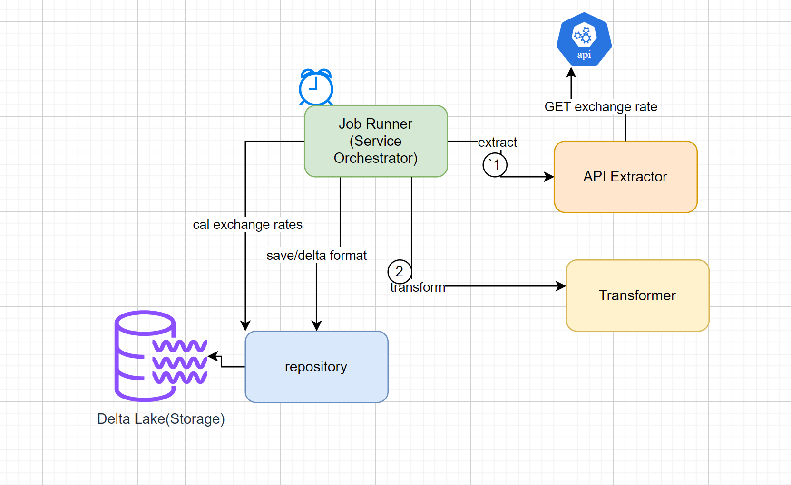

# currency-exchange-processor
## Overview

The aim of this currency exchange processor application is to extract AUD to NZD currency exchange rates 
from Australian exchange office , transform and load into data store to get insights like best rate ,the lowest rate and averages rates

This application uses XE exchange rate API endpoints to fetch currency rates from Australian exchange.

Note: The application used python temporary folder location to use to storage layer to persist delta tables
## Technical Diagram


### How to build the app
````
 cd curency-exchange-processor
 python3 -m pip install --upgrade pip
 python3 -m pip install deltalake aiohttp flatten-json
 python3 -m pip install -r /app/src/requirements.txt
 python ./src/etl_scripts/job_runner.py
````
### API Configuration used
````
exchange_api:
  base_url: ${API_BASEURL}  -- API endpoint url
  api_id: {API_ID}   -- API application ID
  api_key: ${API_KEY}  -- API KEY used for authentivcation
  to: NZD 
  start_date: ${start_date}  -- start date of exchange poll
  total_days: 30        -- total number of days previous days from the start date 
````
